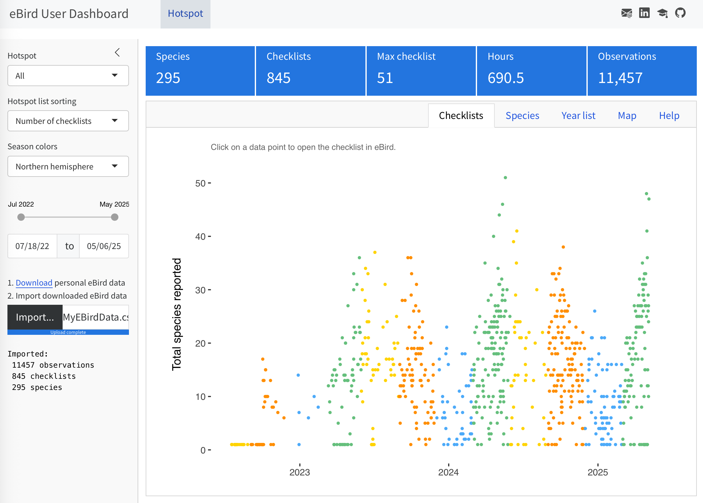
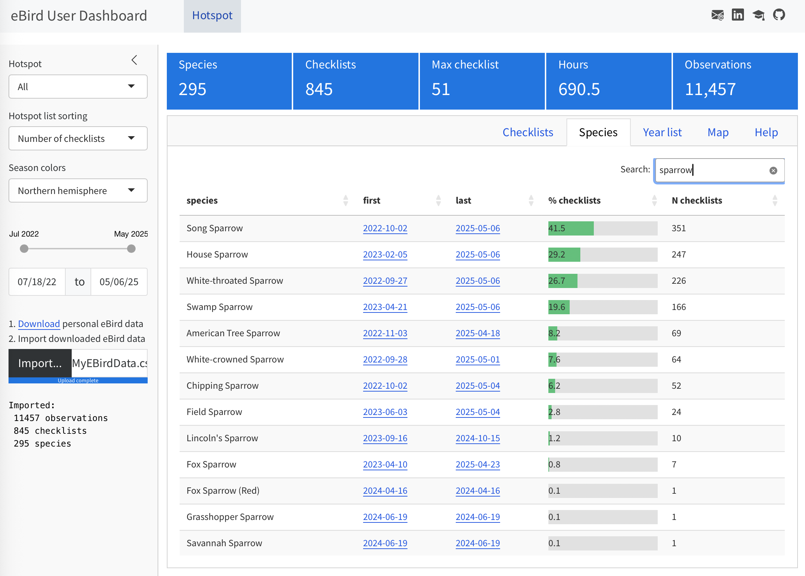
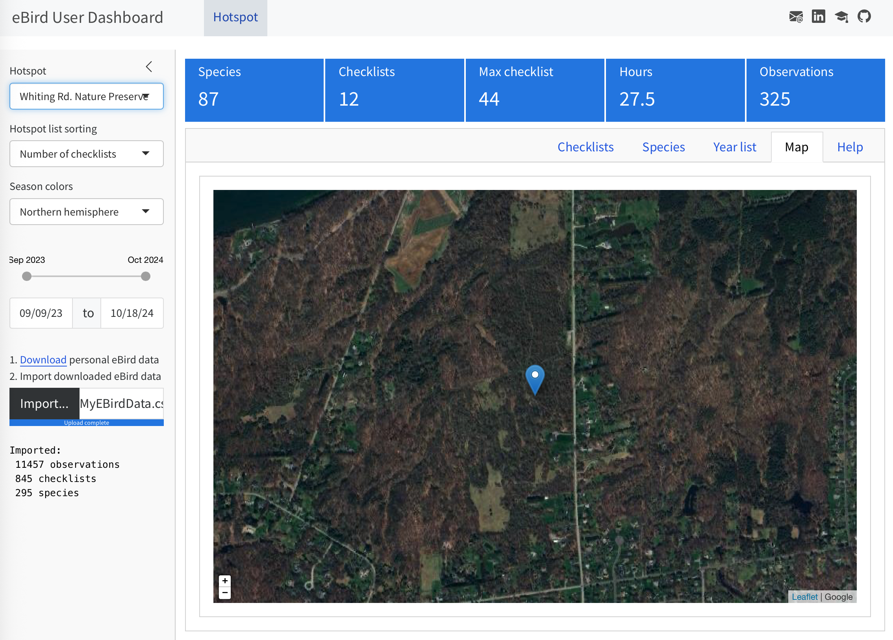

This dashboard written in Quarto/R/Shiny allows a user to upload explore their personal eBird data.

**IMPORTANT**: Requires your personal eBird data in a file named `MyEBirdData.csv`. Download your data [here](https://ebird.org/downloadMyData).

