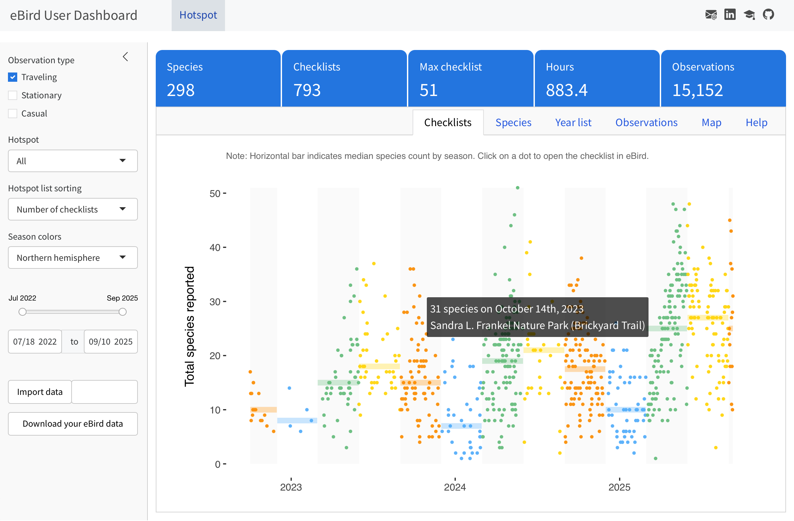
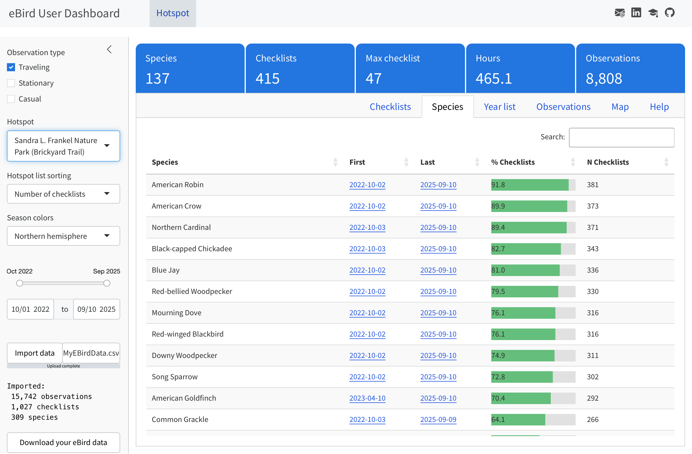
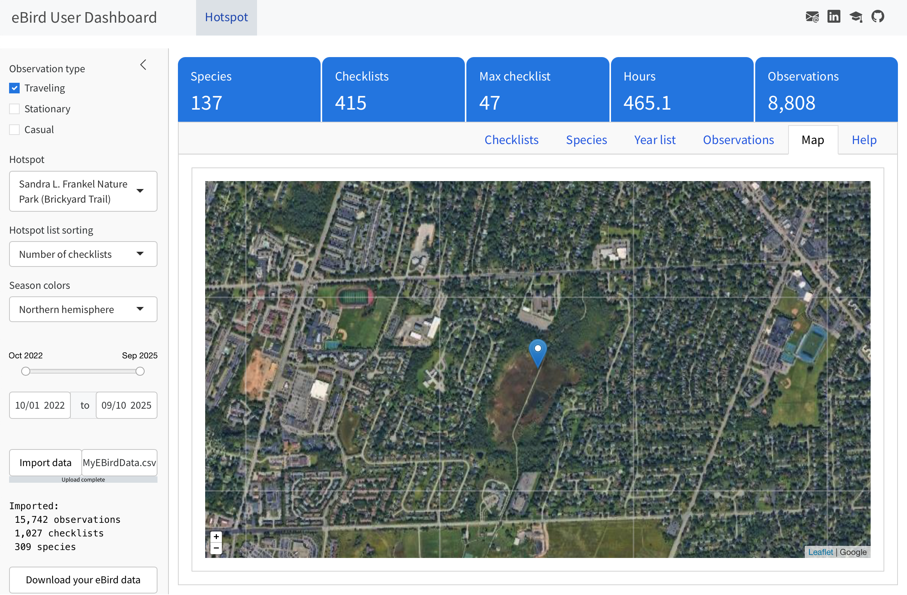
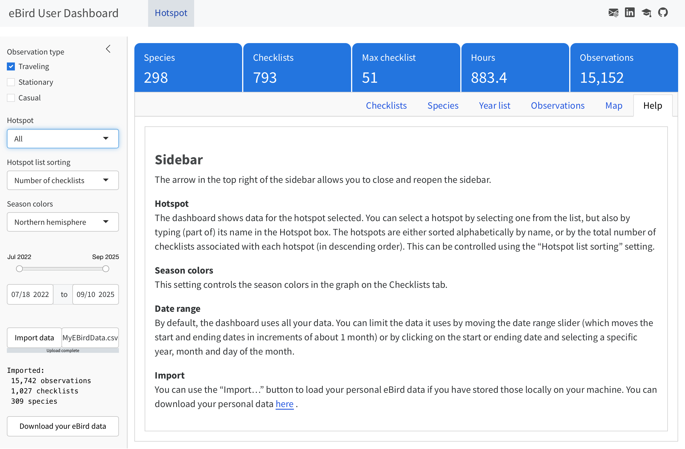

This dashboard, written in Quarto/R/Shiny, allows a user to upload and explore their personal eBird data.

**Recent updates**

09/10/25: Added observation type filter; added median checklist count for each season to Checklists visualization

**IMPORTANT**: Requires your personal eBird data in a file named `MyEBirdData.csv`. Download your data [here](https://ebird.org/downloadMyData).

## Checklists

## Species

## Year List

## Observations

## Map

## Help

